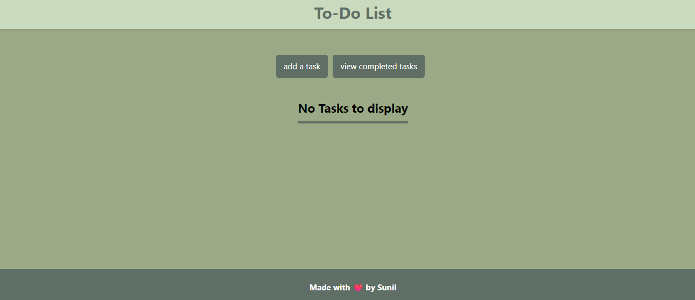
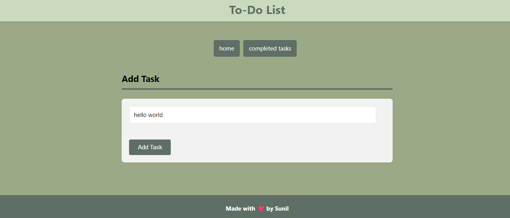
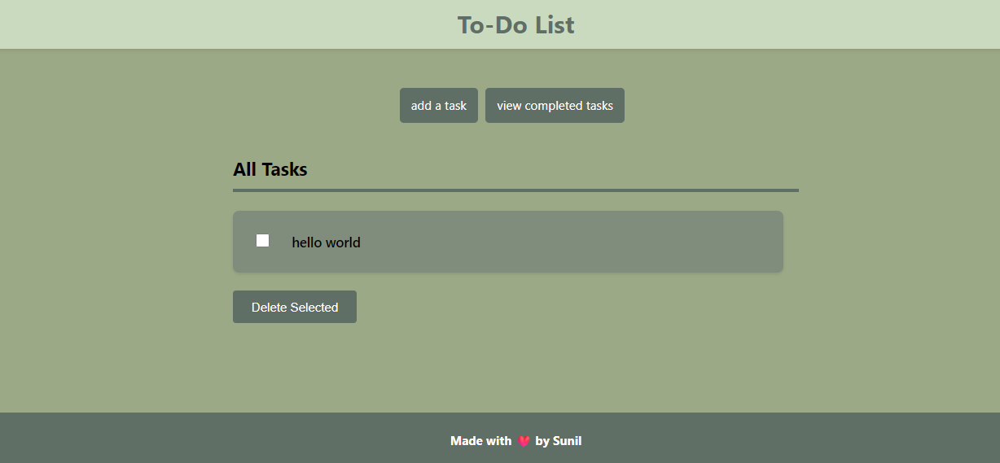
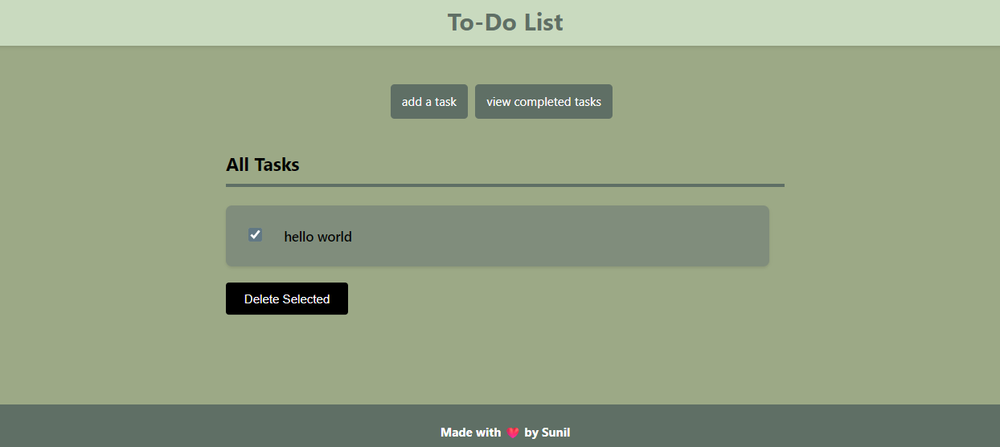
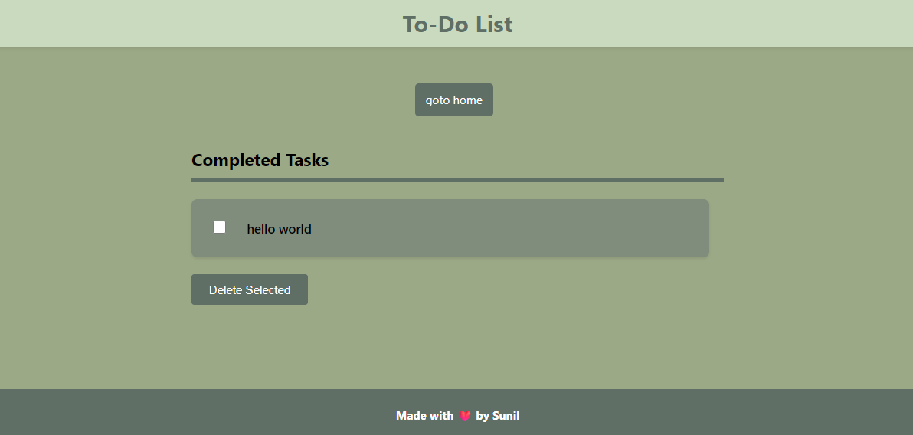
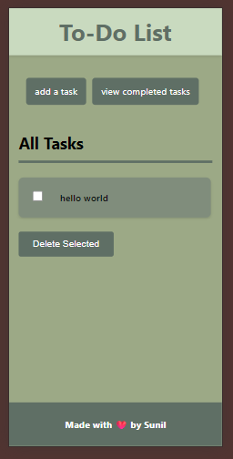

# 📝 Django To-Do List

[](https://www.python.org/)
[](https://www.djangoproject.com/)
[](LICENSE)
[](#)

A simple yet **clean and polished** To-Do List web application built with **Django** and **SQLite**.  
You can **add new tasks** and **mark them as complete** with a smooth, minimal UI.

---

## ✨ Features

- ➕ Add new tasks easily  
- ✅ Mark tasks as complete  
- 🗑️ Auto-hide completed tasks (optional)  
- 📂 Uses SQLite (default Django DB)  
- 🎨 Clean and responsive UI  
- 🔒 Environment variables for security  
- 📱 responsive for smartphones and tablets too.

---

## 📸 Screenshots

<h3>Main Screen</h3>

<h3>Add Task</h3>

<h3>Added task preview in homescreen</h3>

<h3>deleting a Task</h3>

<h3>Completed Tasks page</h3>

<h3>SmartPhone view</h3>



---

## 🚀 Installation Guide

### 1️⃣ Clone the Repository
```bash
git clone https://github.com/yourusername/django-todo-list.git
cd django-todo-list
```


### 2️⃣ Create & Activate a Virtual Environment

Windows
```bash
python -m venv venv
venv\Scripts\activate
```

Mac/Linux
```bash
python3 -m venv venv
source venv/bin/activate

```

### 3️⃣ Install Dependencies

(Using Pipenv with Pipfile.lock)
```bash
pip install pipenv
pipenv install --ignore-pipfile
```

Or if using pip:
```bash
pip install -r requirements.txt
```

### 4️⃣ Create a .env File

Inside the project root:
'enter any key combinations in secret key'
```bash
SECRET_KEY="your-secret-key"
DEBUG=True
```

### 5️⃣ Run Database Migrations
```bash
python manage.py makemigrations
python manage.py migrate
```

### 6️⃣ Start the Development Server
```bash
python manage.py runserver
```

Visit: http://127.0.0.1:8000/ 🎉
